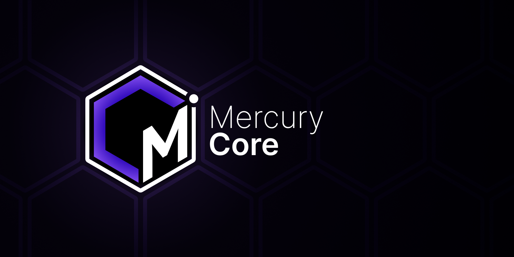

# 

Mercury Core is the ultimate community-driven secure, flexible, and stable foundation for the future of your revival web platform, allowing for easy customisation or complete overhaul and possible integration with multiple clients and external services.

> If you don’t know what any of those things are, Mercury Core is a build-your-own-Roblox.

## Contents

-   [Recommended development setup](#recommended-development-setup)
-   [Editing the code](#editing-the-code)
-   [Hosting](#hosting)
-   [Mercury Core's stack](#mercury-cores-stack)
    -   [Route structure](#route-structure)

# Recommended development setup

We recommend using [Visual Studio Code](https://code.visualstudio.com) as your editor, as it has great support for languages like Typescript, Svelte, and Go, and allows for easier navigation of the codebase. Derivatives like [Insiders](https://code.visualstudio.com/insiders/) and [VSCodium](https://vscodium.com) are also recommended (all we're saying is something a little more than Notepad++).

The [Mercury Core development](https://marketplace.visualstudio.com/items?itemName=MercuryCore.mercurycoredevelopment) extension pack is also recommended, as it includes all the extensions needed to work with the codebase alongside a couple for general quality-of-life improvements.

# Editing the code

You will need:

-   Latest version of Bun installed (expected as `bun`)
-   Latest version of Docker installed (expected as `docker`)
-   A terminal
-   A modern web browser (Mid 2023 onwards for most major browsers)
-   A computer, as it would be painful to live without one, wouldn't it?

Instructions:

-   Clone the repository to your local machine
-   Open a terminal and navigate to the directory of the repository
-   Run `bun i` to install all dependencies
-   Copy the `.env.example` file to `.env` to set up the environment variables (if the containers are set up on localhost, likely nothing needs to be changed)
-   Run `docker compose up -d` to start the database and economy service

To start a local dev server, run `bun -b dev` and navigate to the link shown in the terminal (remember not to use HTTPS!). Upon saving a file, your changes will be shown in the web browser.

-   If you are using WSL2, the server may not correctly reflect the changes you make if the repository is stored on the Windows drive. To fix this, move the repository into a folder managed by WSL, or alternatively add the following to the default export of vite.config.ts:

```ts
server: { watch: { usePolling: true } },
```

After starting a local web server, navigate to /register and make an account.

-   While in the browser, you can press ctrl-i to open the inspector, allowing you to select any element and show it in your editor.

To build for production, run `bun run build` then `bun preview` (or `bun buildview`) to preview the final site.

Data from the database is stored in the /data/surreal directory.

# Hosting

You will need:

-   Latest version of Bun installed (expected as `bun`)
-   Latest version of Docker installed (expected as `docker`)
-   Latest version of Caddy server installed (expected as `caddy`)
-   A terminal
-   Some sort of server hardware

Instructions:

-   Clone the repository to your server, and navigate to its directory
-   Run `caddy start` to start the Caddy reverse proxy server
    -   You can also run `caddy reload` to reload the configuration file without restarting the server.
    -   If you're using Caddy with multiple configuration files, import the Caddyfile in the repository's root directory into a Caddyfile somewhere else, and run `caddy start` and `caddy reload` from there.
-   Run `docker compose up -d` to start the database and economy service
-   Copy the `.env.example` file to `.env` to set up the environment variables (if the containers are set up on localhost, likely nothing needs to be changed)
-   Open a terminal and navigate to the directory of the repository
-   Run `bun -b prod` to install dependencies and begin building
-   Run `bun ./build` (not to be confused with `bun build`) to start Mercury Core.
    -   Several methods can be used to run it as a background process as well.

# Mercury Core's stack

Mercury's frontent is built with [Svelte](https://svelte.dev), a UI framework that compiles to vanilla JS, and [SvelteKit](https://kit.svelte.dev), a powerful full-stack framework for building transitional apps.

The site uses [Typescript](https://typescripts.org) throughout, a language that adds type extensions ontop of Javascript. Intellisense and type checking are used as well, as they help to prevent bugs and improve understanding of the codebase.

[SurrealDB](https://surrealdb.com) is used as the database, a powerful multi-model database that easily allows for storing and querying the highly relational data used in Mercury.

[Vite](https://vitejs.dev) brings the stack for the website together, giving an extremely fast and responsive development environment, as well as zero-downtime deployments.

[Caddy](https://caddyserver.com) is used as a reverse proxy server, which allows for automatic HTTPS and TLS certificates, rewriting URLs, and provides a simpler configuration interface than popular alternatives like Apache or nginx.

## Route structure

Actual pages for the site are stored in /src/routes. The structure for them might look crazy at first, but it makes it very simple to differentiate between clientside and serverside code, and layout groups help to heavily reduce boilerplate and code duplication.

See the [SvelteKit Routing docs](https://kit.svelte.dev/docs/routing) for more information.

The markup for pages is enhanced with HTMLx templating, which adds extra features such as adding variables, reactivity, and logic blocks such as {#if} and {#each}.

Take a look at the [Svelte docs](https://svelte.dev/docs), or the incredibly helpful [Svelte tutorial](https://learn.svelte.dev), for more information.
